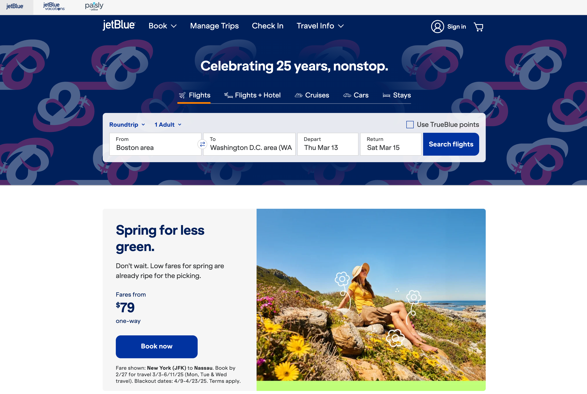

# JetBlue


## Prompt

You’ll be running a mock customer intro call, combining elements of Discovery and an introduction + demo of Vercel on a
call with frontend engineers & product managers. The goal is to introduce Vercel to the prospect, begin to demonstrate
how it could be relevant to their needs, and set the stage for further sales conversations.

## Demo

This Next.js application is a light demo of the JetBlue website built with the help of [V0](https://v0.dev).
Created entirely using the newest Next.js App Router, this statically generated application is built intending to
highlight Vercel's Platform features and cohesive integrations with Next.js

### Customer Discovery

1. What do you know already know about Next.js and Vercel?
2. Given existing tech stack (**Angular deployed on Fastly**):
    * What's the catalyst for this conversation today?
    * What's biggest pain points facing your engineering team?
3. What long term goals do you have for your product / company?

### Technical Discovery

1. How does your development team go from idea to production?

   ###### Development
    * Angular / ASP.NET?
    * Server Rendering?
    * Generative AI?

   ###### Integrations
    * Content Management (**Magnolia Headless CMS**)
    * Analytics (**Omni, Gladly, Google Analytics**)
    * Internal APIs (`JBRest`)
    * Feature Flags?
    * AI?
    * Other?

   ###### Collaboration
    * Pull Requests?
    * Product / Design Feedback?

   ###### Deployments
    * Pull Requests?
    * Product / Design Feedback?

   ###### Infrastructure
    * Cache
    * Scaling
    * Observability (**Sentry, App Dynamics**)

### Vercel Introduction

* [Vercel.com](https://vercel.com/home)
    * Three product verticals
        * Vercel roots in automatic deployments
        * Saw need for performant web applications
        * Built abstraction from infrastructure

### Demo

#### Performance

A fast website keeps users engaged, improves conversion rates, and boosts search rankings, directly impacting revenue.
Slow load times frustrate users and lead to lost opportunities converting users.

* Rendering Strategies
* Cache (and revalidation APIs)
* Integrated Speed Insights
* Compute (Fluid - Serverless Servers)
* Observability (framework cohesion)

#### Developer Experience

A smooth development process enables faster feature releases by reducing time spent on complex infrastructure and
deployment challenges, allowing your team to focus on building valuable features that drive business growth.

* Automated Deployments / Rollbacks
* Preview Environments
* Toolbar / Collaboration
* Integrated Feature Flags
* Analytics

#### Security

Protecting customer data and preventing cyber threats are essential for maintaining trust and avoiding costly breaches.
A secure application minimizes business risks and ensures compliance with industry regulations.

* Firewall (WAF)
* Challenge Mode
* DDos Mitigation
* Server Actions

### Vercel's Value

1. Performance
2. Security
3. Developer Experience

### Final Questions

1. What specific demo / presentation items felt relevant to dive deeper on?
2. Vercel / Next.js present potential change, what initial concerns do you have?
3. Any immediate questions I can address?

### Follow-Up Resources

[Angular on Vercel](https://vercel.com/solutions/angular)

[How to Deploy Angular on Vercel](https://vercel.com/guides/deploying-angular-with-vercel)

[Incremental Migration Guide](https://vercel.com/docs/incremental-migration/migration-guide)

[Built With (Tech Stack)](https://builtwith.com/jetblue.com)

## Current Website

The existing [`jetblue.com`](https://www.jetblue.com) website, built using [Angular](https://angular.dev/) and deployed
on [Fastly.com](https://www.fastly.com/), currently looks like this:



However, after a bit of research, there exists some performance problems as demonstrated with Google's Pagespeed
Insights
page [here](https://pagespeed.web.dev/analysis/https-www-jetblue-com/u6lvzn034u?form_factor=mobile):


## Development

### Development Server

```bash
pnpm install
pnpm run dev
```

Open [http://localhost:3000](http://localhost:3000) with your browser to see the result.

You can start editing the page by modifying `app/page.tsx`. The page auto-updates as you edit the file.

### Production Server

```bash
pnpm install
pnpm run build
pnpm run start
```

Your app should be up and running on [http://localhost:3000](http://localhost:3000)!

## Framework

To learn more about Next.js, take a look at the following resources:

- [Next.js Documentation](https://nextjs.org/docs) - learn about Next.js features and API.
- [Learn Next.js](https://nextjs.org/learn) - an interactive Next.js tutorial.

You can check out [the Next.js GitHub repository](https://github.com/vercel/next.js/) - your feedback and contributions
are welcome!
